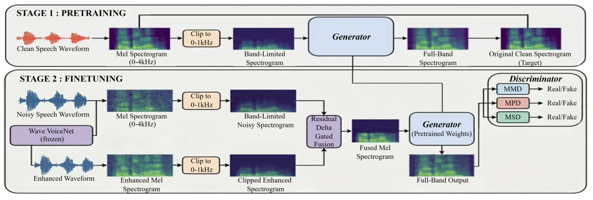

# RAD-GAN: mmWave Radar Aware Dual-Conditioned GAN for Speech Reconstruction

<p align="center">
  <a href="https://arxiv.org/pdf/2602.22431">📄 Paper</a> &nbsp;•&nbsp;
  <a href="https://rad-gan-demo-site.vercel.app/">🎧 Audio Demos</a>
</p>

Official implementation of **RAD-GAN**, a two-stage GAN pipeline for reconstructing intelligible speech from low-SNR (-5 dB to -1 dB) mmWave radar captures through glass walls.

> **Jash Karani, Adithya Chittem, Deepan Roy, Sandeep Joshi** — BITS Pilani

---

## Overview

Millimeter-wave (mmWave) radar captures are band-limited and noisy, making speech reconstruction difficult. RAD-GAN addresses this through:

- **Two-stage training**: Phase 1 pretrains a HiFi-GAN generator on synthetically clipped clean speech; Phase 2 fine-tunes on fused mel spectrograms from real radar data.
- **Multi-Mel Discriminator (MMD)**: A two-branch 2D mel spectrogram discriminator (spectral-norm + weight-norm) for stable and realistic reconstruction.
- **Residual Fusion Gate (RFG)**: Fuses noisy mel with WaveVoiceNet-enhanced mel through a learned residual gate, providing rich conditioning to the generator.

### Architecture

<p align="center">
  
</p>

### Results

**Table 1: Model Comparison** (Weighted Score = 0.4 × Task1 + 0.6 × Task2)

| Model | PESQ | ESTOI | CS-MFCC | DNSMOS | Task 1 | Task 2 | Weighted |
|-------|------|-------|---------|--------|--------|--------|----------|
| WaveVoiceNet [6] | 1.302 | 0.173 | 0.675 | 1.558 | 0.309 | 0.228 | 0.260 |
| HiFi-GAN [7] | 1.311 | 0.144 | 0.627 | 2.286 | 0.332 | 0.258 | 0.288 |
| DCCTN [23] | 1.547 | 0.080 | 0.377 | 1.318 | 0.179 | 0.167 | 0.172 |
| AP-BWE [24] | 1.174 | 0.065 | 0.449 | 1.472 | 0.196 | 0.144 | 0.165 |
| DiffWave [25] | 1.230 | 0.058 | 0.288 | 1.083 | 0.117 | 0.100 | 0.106 |
| CDiffuSE [26] | 1.175 | 0.091 | 0.301 | 1.225 | 0.149 | 0.100 | 0.119 |
| **RAD-GAN (ours)** | **1.310** | **0.190** | **0.669** | **2.688** | **0.387** | **0.297** | **0.333** |

**Table 2: Ablation Study**

| Config | Description | PESQ | ESTOI | CS-MFCC | DNSMOS | Task 1 | Task 2 | Weighted |
|--------|-------------|------|-------|---------|--------|--------|--------|----------|
| B0 | HiFi-GAN baseline | 1.311 | 0.144 | 0.627 | 2.286 | 0.332 | 0.258 | 0.288 |
| B1 | B0 + MMD + MR-STFT | 1.307 | 0.160 | 0.588 | 2.449 | 0.347 | 0.251 | 0.290 |
| B2 | B1 + pretraining | 1.286 | 0.179 | 0.621 | 2.639 | 0.376 | 0.269 | 0.312 |
| B3 | B2 + WVN conditioning | 1.310 | 0.190 | 0.669 | 2.688 | 0.387 | 0.297 | 0.333 |

---

## Repository Structure

```
RADGAN/
├── src/
│   ├── config/
│   │   ├── train_radgan.yaml        # RAD-GAN training config
│   │   └── train_baseline.yaml      # WaveVoiceNet config
│   ├── metrics/
│   │   ├── pesq.py                  # Narrowband PESQ
│   │   ├── estoi.py                 # ESTOI
│   │   ├── mfcc_cosine.py           # MFCC cosine similarity
│   │   ├── dnsmos.py                # DNSMOS wrapper
│   │   └── DNSMOS/                  # ONNX models + local scoring
│   ├── models/
│   │   ├── radgan.py                # RAD-GAN Lightning module (Phase 2, RFG + WVN)
│   │   ├── wavevoicenet.py          # WaveVoiceNet baseline (Step 1, RFG conditioning)
│   │   ├── base_model.py            # Base class with metrics
│   │   └── gan/                     # Generator, discriminators, losses
│   │       ├── network.py           # Generator, MPD, MSD, MMD, RFG
│   │       ├── pretrain.py          # Phase 1 pretraining script
│   │       ├── mel_dataset.py       # Mel spectrogram + dataset
│   │       ├── inference.py         # Standalone inference
│   │       ├── env.py               # AttrDict config helper
│   │       ├── utils.py             # Checkpoint helpers
│   │       └── config.json          # Generator hyperparameters
│   ├── scripts/
│   │   ├── hear_output.py           # Inference demo (single audio)
│   │   └── plot_time_domain_and_stft.py  # Waveform + spectrogram plotting
│   ├── train.py                     # Main training entry point
│   ├── datamodule.py                # Data loading
│   ├── utils.py                     # YAML helpers
│   ├── preprocessing/
│   │   ├── spectral_preprocessing.py
│   │   ├── wiener_filter.py
│   │   └── enhance_harmonics.py
├── outputs/
│   ├── audios/                      # Inference audio outputs
│   └── plots/                       # Generated plots
├── figs/
│   └── block_diagram.png            # Architecture diagram
├── environment.yml                  # Conda environment
├── requirements.txt                 # pip dependencies
├── LICENSE
└── README.md
```

---

## Installation

### Option A: Conda (recommended)

```bash
git clone https://github.com/chitadi/RADGAN.git
cd RADGAN

# Create the conda environment
conda env create -f environment.yml
conda activate radgan
```

For GPU support, ensure you have NVIDIA drivers and CUDA 12.4 installed. The `environment.yml` pulls PyTorch with CUDA 12.4 support automatically.

### Option B: pip

```bash
git clone https://github.com/chitadi/RADGAN.git
cd RADGAN

# Create a virtual environment
python -m venv venv
source venv/bin/activate  # Linux/Mac
# venv\Scripts\activate   # Windows

# Install PyTorch separately (see https://pytorch.org for your CUDA version)
pip install torch torchaudio --index-url https://download.pytorch.org/whl/cu124

# Install remaining dependencies
pip install -r requirements.txt
```

---

## Dataset

This project uses the [RASE 2026 Challenge](https://rase-challenge.github.io/RASE2026-Challenge/) dataset. The dataset includes paired radar-captured (noisy) and microphone-recorded (clean) speech at 8 kHz.

After obtaining the dataset, place it in the repo root:

```
RADGAN/
├── dataset/
│   ├── Task1/
│   │   ├── Clean/
│   │   │   ├── train/
│   │   │   └── val/
│   │   └── Recorded/
│   │       ├── train/
│   │       └── val/
│   └── Task2/
│       ├── Clean/
│       │   ├── train/
│       │   └── val/
│       └── Recorded/
│           ├── train/
│           └── val/
```

Recorded filenames end with `_recorded_aligned.wav` and are paired with clean files of the same name (without the suffix).

> **Note:** The dataset is private. Please reach out to us at **chittemadithya@gmail.com** with your use case to acquire the dataset.

---

## Training

RAD-GAN uses a three-step training pipeline. Each step builds on the previous one's outputs.

### Step 1: Train WaveVoiceNet

WaveVoiceNet is trained separately and used as a frozen conditioning model during Phase 2. Its enhanced mel spectrograms are fused with the noisy mel via the Residual Fusion Gate (RFG).

```bash
cd src
python train.py --config config/train_baseline.yaml
```

This trains for 30 epochs (batch size 8, gradient accumulation 8, learning rate 1e-3). Save the best checkpoint to `src/models/wvn.ckpt`, or update `wvn_ckpt_path` in `config/train_radgan.yaml` to point to your checkpoint.

### Step 2: Phase 1 — Pretraining

Pretrain the HiFi-GAN generator on synthetically clipped clean speech (band-limited to 1 kHz):

```bash
cd src
python -m models.gan.pretrain
```

This saves generator checkpoints to `src/models/gan/checkpoints_pretrain/`. Pretraining runs for ~66k steps (~6 hours on an NVIDIA A6000).

### Step 3: Phase 2 — Fine-tuning with RFG

Fine-tune the generator with adversarial losses and WVN conditioning via the Residual Fusion Gate:

```bash
cd src
python train.py --config config/train_radgan.yaml
```

The Phase 1 generator weights are loaded automatically from `checkpoints_pretrain/`. The frozen WaveVoiceNet is loaded from `wvn_ckpt_path` in the config. During each training step, WVN runs inference on the 4-second recorded snippet, its enhanced mel is fused with the noisy mel via the RFG, and the fused mel conditions the generator. Fine-tuning runs for ~100k steps (~14 hours on an NVIDIA A6000).

**Crop strategy:** Training uses fixed crops (first 4 seconds of each clip). Validation/scoring uses energy-centered crops (deterministic, centered on the active speech region).

### Smoke Test (CPU)

Verify the full pipeline works without a GPU:

```bash
cd src
python train.py --config config/train_radgan.yaml --fast-dev-run
```

This runs 1 epoch with 5 batches. Set `accelerator: "cpu"` in the config or rely on PyTorch Lightning's auto-detection. You'll need a trained WaveVoiceNet checkpoint at the path specified by `wvn_ckpt_path`, or set `wvn_ckpt_path: null` to test without RFG fusion (ablation B2).

### Resuming from a Checkpoint

```bash
python train.py --config config/train_radgan.yaml --ckpt_path path/to/checkpoint.ckpt
```

### WandB Logging (optional)

To enable Weights & Biases logging, set the environment variable:

```bash
export WANDB_API_KEY="your-api-key"
export WANDB_PROJECT="rad-gan"        # optional, defaults to "rad-gan"
export WANDB_ENTITY="your-team"       # optional
```

If `WANDB_API_KEY` is not set, only CSV logging is used.

---

## Inference

Run inference on a single audio file:

```bash
cd src
python -m scripts.hear_output \
    --config config/train_radgan.yaml \
    --checkpoint path/to/model.ckpt \
    --audio path/to/recorded.wav \
    --clean path/to/clean.wav \
    --output-dir ../outputs/audios
```

This saves `noisy.wav`, `enhanced.wav`, and `clean.wav` to the output directory.

### Plotting

Generate time-domain and STFT spectrogram plots:

```bash
cd src
python -m scripts.plot_time_domain_and_stft \
    --files ../outputs/audios/clean.wav ../outputs/audios/noisy.wav ../outputs/audios/enhanced.wav \
    --labels Clean Noisy Enhanced \
    --output-dir ../outputs/plots
```

---

## Metrics

The following metrics are computed during evaluation:

| Metric | Description |
|--------|-------------|
| PESQ | Perceptual Evaluation of Speech Quality (narrowband, 8 kHz) |
| ESTOI | Extended Short-Time Objective Intelligibility |
| DNSMOS | Deep Noise Suppression Mean Opinion Score (P.835) |
| CS-MFCC | MFCC Cosine Similarity |

The weighted score is defined as:

```
TaskScore = (norm_PESQ + norm_DNSMOS + CS_MFCC + ESTOI) / 4
WeightedScore = 0.4 × Task1 + 0.6 × Task2
```

---

## Citation

If you use this work, please cite:

```bibtex
@article{karani2026radgan,
  title={mmWave Radar Aware Dual-Conditioned GAN for Speech Reconstruction of Signals With Low SNR},
  author={Karani, Jash and Chittem, Adithya and Roy, Deepan and Joshi, Sandeep},
  journal={Open MIND},
  year={2026},
  eprint={2602.22431},
  archivePrefix={arXiv}
}
```

---

## Acknowledgements

This project builds upon:
- [RASE 2026 Challenge](https://rase-challenge.github.io/RASE2026-Challenge/) dataset

## License

[MIT](LICENSE)
